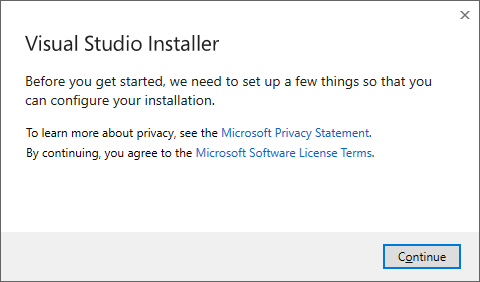
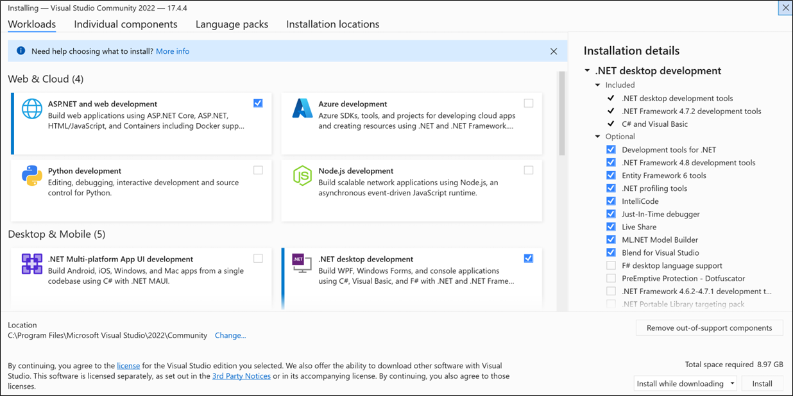

# Installing Visual Studio and VB.net package
This is a documentation on how to install visual studio 2022 and development packages after installation.

## Installing Visual Studio
1. Download the Visual Studio installer for Windows from the official website: [Visual Studio](https://visualstudio.microsoft.com/downloads/?cid=learn-onpage-download-cta) and make sure to choose the community version which is free for individual developers, open source projects, academic research, education, and small professional teams.

2. Once the download is complete, you will have the ICON below in your download location. You can then run the installer.

3. Follow the installation wizard to install Visual Studio installer.

4. Once the installation is complete, you will be prmpted to choose a package to install with your visual studio application.  You can choose the `.NET desktop development` package which includes the `Visual Basic .NET` package.

The only thing you need is the .NET in the desktop development package. You can also choose other packages if you are interested in them, but the more packages you choose, the more space it will take on your computer, and the data it will consume.

5. You can either select a new location to install Visual Studio or use the default location. `Note: Don't touch it if you don't know anything about it. and don't check any box if you don't know what it does.`

6. Once that is done, you can continue with the next section on how to create .NET applications.

## Creating vb.NET Applications
1. Open Visual Studio from the start menu or the desktop icon, since you have installed it from the previous section guide. You will be greeted with the welcome page below. Click on create a new project. The list of contents on the left hand side of the image shows the list of projects you've working on. If you're using Visual Studio for the first time, you won't have any project listed there.

2. You will be greeted with the window below. You can choose the type of project you want to create. Choose the `Windows Forms App (.NET Framework)` to create a desktop application.

3. You will be prompted to choose a name for your project and the location to save it. You can also choose the .NET framework version you want to use. The latest version is recommended. And don't forget to check the box that says `place your solution and project in the same directory`. This will help you to easily locate your project files.

4. You will be taken to a next screen. Don't chnage anything there. Just click on the `Create` button to create your project.

5. Once the project is created, you will be greeted with the window below. This is the main window where you will be doing all your coding. You can see the toolbox on the left hand side of the image. This is where you will find all the controls you will be using to design your application. You can also see the solution explorer on the right hand side of the image. This is where you will find all the files you will be working with in your project.

6. You can now start designing your application by dragging and dropping controls from the toolbox to the form. You can also start coding by double clicking on any control to create an event for it.

Happy Coding! 🎉🎉🎉